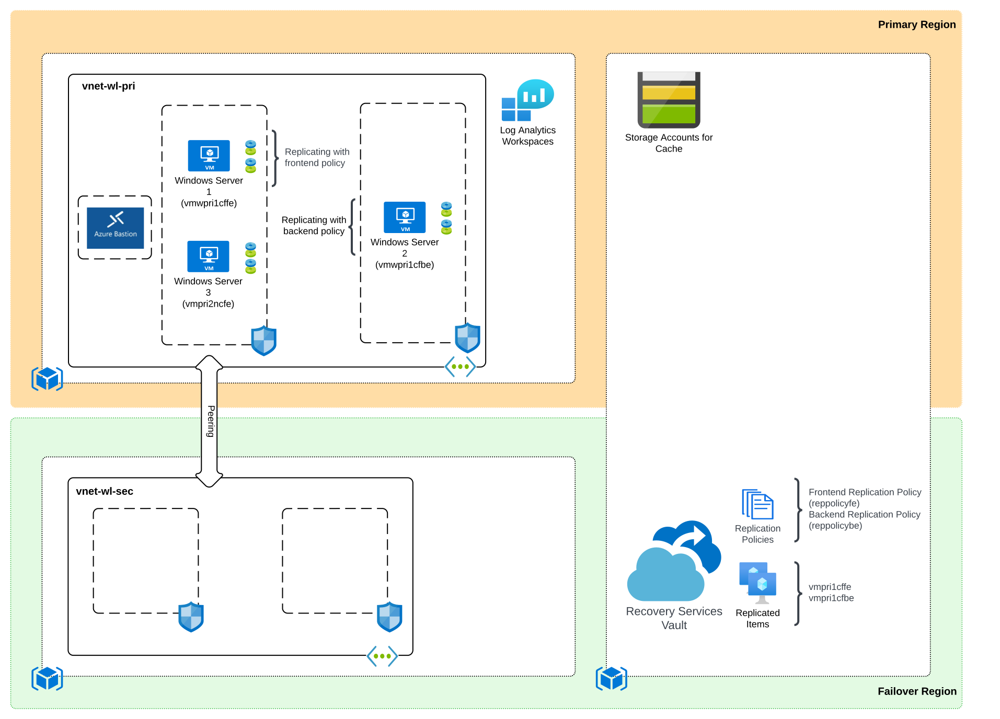
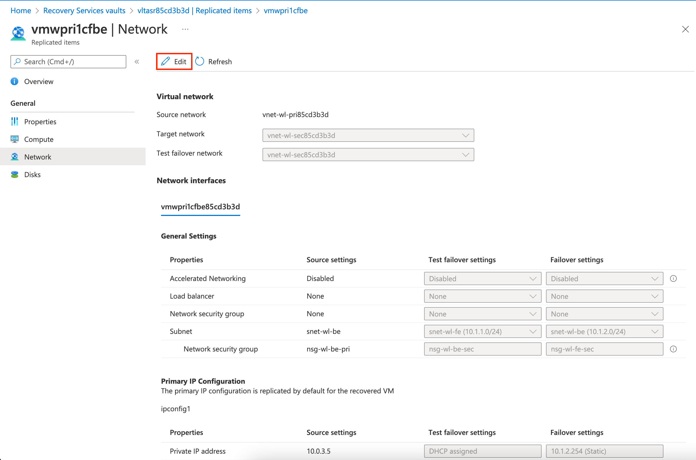

# Azure Site Recovery Demonstration

This repository includes a variety of artifacts that can be used to learn and demonstrate a subset of capabilities for Azure Site Recovery. Azure Site Recovery is a native disaster recovery solution in the Microsoft Azure cloud. It provides replication of virtual machines between a primary and secondary location enabling failover to the second site in the case of a primary site outage. In addition to disaster recovery, the service can also be used for migrating workloads within Azure. A full summary of use cases is documented [here](https://docs.microsoft.com/en-us/azure/site-recovery/site-recovery-overview#what-does-site-recovery-provide). 

The artifacts in this repository are focused on the following use cases:

* Replication of Azure VMs between Azure Regions
* Replication of VMWare VMs to Azure

## Artifacts
The artifacts include a PowerPoint overview deck, deployable lab to learn and demonstrate features and capabilities, and a step-by-step guide on how to demonstrate specific features.

## Lab Environment
The deployable lab included in this repository is coded using [ARM resource templates](https://docs.microsoft.com/en-us/azure/azure-resource-manager/templates/syntax) and uses a combination of PowerShell and Bash scripts and DSC to pre-configure resources deployed.

The focus of the lab is on replication of Azure VMs within Azure. The resources deployed in this lab are distributed across three resource groups and two regions referred to as the primary and secondary regions. The resource group in the primary region contains virtual machines, storage account, Log Analytics Workspace, and virtual network. The resource group in the secondary region contains an empty virtual network and a Recovery Services Vault.

Three virtual machines are deployed to the primary region. Two virtual machines (vmwpri1cffe, vmpri1cfbe) are configured in separate subnets and are intended to emulate a multi-tier application. Both of these machines have been configured for replication with Azure Site Recovery. The third virtual machine (vmpri2ncfe) has not been configured for Azure Site Recovery and be can be used to demonstrate the process. The storage account in the primary region is the [cache storage](https://docs.microsoft.com/en-us/azure/site-recovery/azure-to-azure-architecture#architectural-components) account used by the service.

The Recovery Services Vault has been configured with two [replication policies](https://docs.microsoft.com/en-us/azure/site-recovery/azure-to-azure-architecture#replication-policy). One replication policy (reppolicybe) is configured for app-consistent snapshots while the other (reppolicyfe) is not. Logs and metrics generated from the Azure Site Recovery Vault are configured to log to an instance of Log Analytics deployed into the lab.

Azure Bastion has been deployed into the primary region virtual network. Both the primary and secondary virtual networks are peered so that Azure Bastion can be used to remote desktop into machines that are failed over.

### Prerequisites
1. You must hold at least the [Contributor RBAC role](https://docs.microsoft.com/en-us/azure/role-based-access-control/built-in-roles#contributor) at the subscription scope in the subscription the resources will be deployed to.

2. You must be capable of deploying resources to two regions. The regions must support availability zones. The templates are configured to allow deployment to regions within the US geopolitical region that support availability zones as 2022. If you wish to deploy to another geopolitical region, you will need to modify the azuredeploy.json template.

3. The virtual machines created in this deployment are deployed into availability zones. The region(s) you deploy the resources to [must support availability zones](https://docs.microsoft.com/en-us/azure/availability-zones/az-region).

### Installation with Azure Portal

Click the Deploy To Azure button below.

### Installation with Azure CLI
1. Set the following variables:
   * DEPLOYMENT_NAME - The name of the location
   * DEPLOYMENT_LOCATION - The location to create the deployment
   * PRI_LOCATION - The primary region to deploy resources to
   * SEC_LOCATION - The secondary paired region to deploy resources to. This is used to demonstrate the cross region restore feature.
   * ADMIN_USER_NAME - The name to set for the VM administrator username
   * SUBSCRIPTION- The name or id of the subscription you wish to deploy the resources to

2. Set the CLI to the subscription you wish to deploy the resources to:

   * **az account set --subscription SUBSCRIPTION**

3. Deploy the lab using the command (tags parameter is optional): 

   * **az deployment sub create --name $DEPLOYMENT_NAME --location $DEPLOYMENT_LOCATION --template-uri https://raw.githubusercontent.com/mattfeltonma/azure-site-recovery-demo/main/azuredeploy.json --parameters priLocation=$PRI_LOCATION secLocation=$SEC_LOCATION vmAdminUsername=$ADMIN_USER_NAME tags='{"mytag":"value"}'**

4.  You will be prompted to provide a password for the local administrator of the virtual machine.

### Post Configuration
1. The support in ARM for Azure Site Recovery is limited. Before performing a test failover, it's recommended that you modify the replicated items to set the virtual network and subnet the machines are failed over to when testing failover. See below as an example.

2. Leave the environment running for at least few hours (24 hours is ideal) to generate recovery points and logging data. Virtual machines should be left on during this time period.

### Exercises
This repository contains a collection of exercises you can perform with the lab to learn or demonstrate the core features of Azure Site Recovery. You can find [the exercises here](/exercises/exercises.md).
### Removal of Resources
It is very important you follow the instructions below when you are done with the lab. If you do not follow these instructions, it could result in shadow resources which will require you to work with support to remove.

1. [Disable protection](https://docs.microsoft.com/en-us/azure/site-recovery/site-recovery-manage-registration-and-protection#disable-protection-for-a-azure-vm-azure-to-azure) for the virtual machines.

2. Delete the resource groups.

