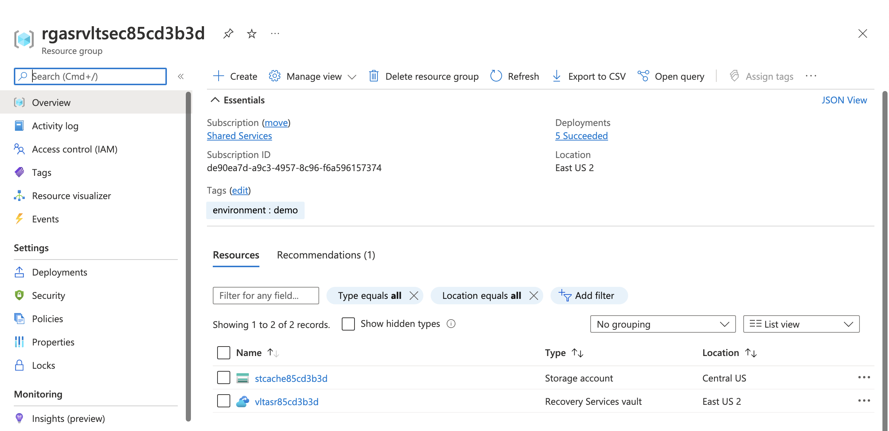

## Exercise 1 - Recovery Services Vault Overview

In this exercise you will open the Azure Portal to look at the resources deployed with the lab. You will learn about [Azure Site Recovery services architecture](https://docs.microsoft.com/en-us/azure/site-recovery/azure-to-azure-architecture) such as the [Recovery Services Vault](https://docs.microsoft.com/en-us/azure/backup/backup-azure-recovery-services-vault-overview) and [cache storage account](https://docs.microsoft.com/en-us/azure/site-recovery/azure-to-azure-architecture#architectural-components).

Open the Azure Portal and select the resource group that begins with rgasrvltsec. The resource group contains two resources, a Recovery Services Vault and an Azure Storage Account.

The Recovery Services Vault is used by the Azure Site Recovery service to store configuration information about the machines configured for replication with a given vault. The configuration information includes items such as the target virtual machine configuration when the machine is failed over, replication policies and recovery plans. You will explore these configuration items in the upcoming exercises.

You will notice the vault has been deployed to the region you specified as the secondary region. The vault must be deployed to the target region that the machines will failover to.

The Azure Storage Account in the resource group is used as the cache storage account. The cache storage account stores disk changes to the virtual machines in the primary region prior to those changes being processed and written to the secondary region. Notice the cache storage account is deployed to the region you specified as the primary region.

Select the resource group that begins with rgasrwlpri. This resource group is used to hold the resources that represent the workload in its normal state.

The resource group contains three virtual machines. The VM named vmwpri1cffe is used to represent a stateless application frontend such as a web server. The VM named vmwpri1cfbe is used to represent a stateful application backend such as a database server. These VMs have been preconfigured to replicate with Azure Site Recovery. The third VM named vmwpri2ncffe is not used in the exercises but provided to you in case ou want to further experiment with the service.

An Azure Bastion instance is provided to allow for remote access to the VMs in both the primary region and VMs failed over to the secondary region.

The Log Analytics Workspace is used to capture Recovery Services logs and metrics. The vault has been configured to send its diagnostics data to the workspace.

Select the resource group that begins with rgasrwlsec. This resource group is used to store foundational resources that will be used by the VMs when they are failed over to the secondary region. 

The resources include a virtual network and network security groups. While you could dynamically create the virtual network when the VM is failed over, it is best practice to prestage core components such as the virtual network, [disk encryption set](https://docs.microsoft.com/en-us/azure/virtual-machines/disk-encryption), and load balancer. You could optionally deploy these as part of a [Recovery Plan using Azure Automation](https://docs.microsoft.com/en-us/azure/site-recovery/site-recovery-runbook-automation). Recovery plans will be discussed in a later exercise.

If you followed the recommendations to let the lab run for a few hours, you will also see managed disks. These are the replica managed disks created by Azure Site Recovery for VMs vmwpri1cffe and vmwpri1cfbe.

This completes exercise 1. You can now proceed to [exercise 2](/exercises/exercise2.md).
