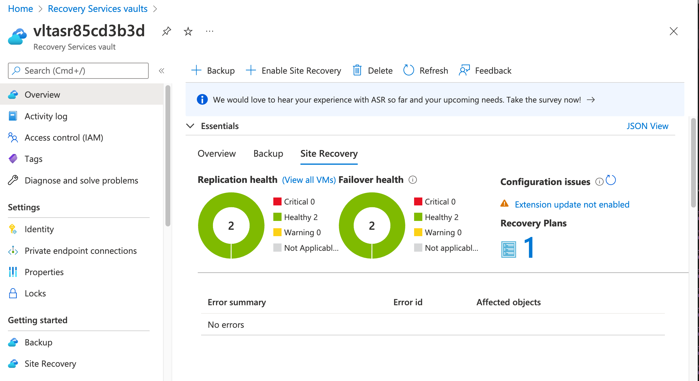
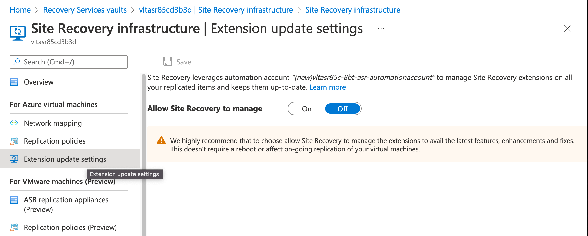
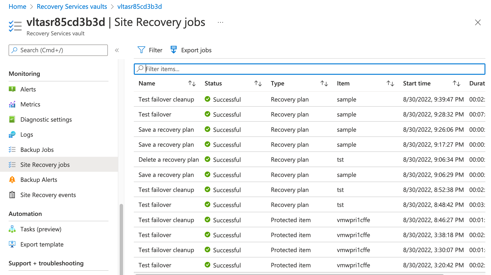
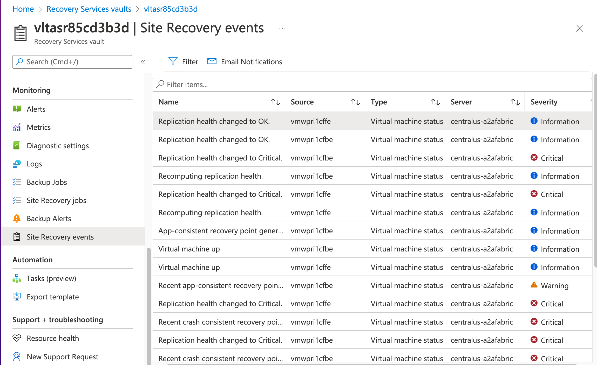

## Exercise 6 - Operating Azure Site Recovery

Azure Site Recovery provides signals in the form of Site Recovery jobs and events which are viewable within the Recovery Service Vault. The Recovery Services Vault also supports diagnostic logs which provide additional logs and metrics which can be sent to an upstream SIEM via an Event Hub, to Azure Storage, or Log Analytics Workspace.

Open the Azure Portal and select the resource group that begins with rgasrvltsec. Select the Recovery Services Vault that begins with vltasr. On the overview page select the Site Recovery option to get a quick view of the status of replication for the machines associated with the vault.

Select the Site Recovery Infrastructure link and then the Extension update settings under the Azure virtual machines section. Azure Site Recovery can use an Azure Automation account to [automatically upgrade the VM's mobility service extension](https://docs.microsoft.com/en-us/azure/site-recovery/azure-to-azure-autoupdate) used by Azure Site Recovery. Microsoft recommends you use the autoupdate feature to ensure you remain current with the service.

Navigate back to the vault overview. Select the Site Recovery jobs link in the Monitoring section. This provides you with a view of the jobs performed by the service and their run time. You can use this to track jobs and troubleshoot a failed replication operation.

Select the Site Recovery events in the Monitoring section. This provides you with a list of events that have occurred with the service. You can optionally setup email notifications.

In addition to the above, Azure Site Recovery provides a number of logs and metrics that can be sent to diagnostic logging. The full detail of this can be found at [this link](https://docs.microsoft.com/en-us/azure/site-recovery/monitor-log-analytics). The link includes sample queries for specific logs which can be helpful in building an Azure Monitor dashboard for centralized monitoring. You can also setup Azure Monitor Alerts as detailed at [this link](https://docs.microsoft.com/en-us/azure/azure-monitor/alerts/alerts-create-new-alert-rule?tabs=metric#create-a-new-log-alert-rule-in-the-azure-portal).

This completes exercise 6 and the exercises for this lab.

